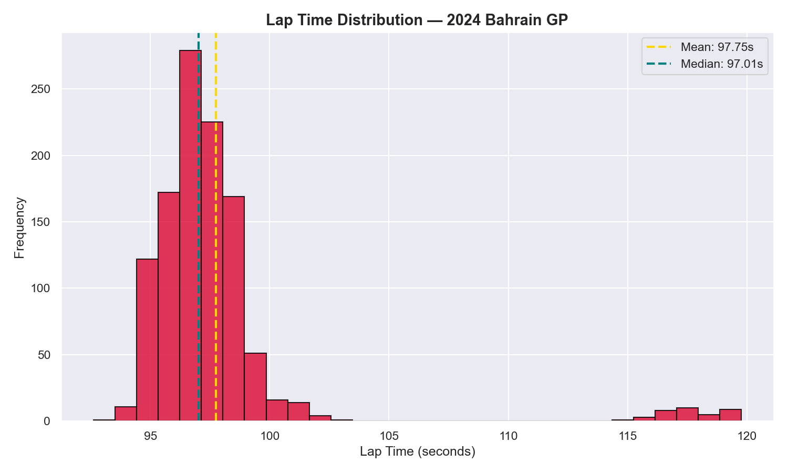

# F1 Race Performance — AI/ML Analysis
**DataCore Analytics Internship 2026**

## What This Project Does
A complete machine learning pipeline that:
- Loads official 2024 Bahrain GP timing data via FastF1
- Cleans and prepares raw lap data
- Performs exploratory data analysis (EDA) with visualisations
- Engineers features and trains a Random Forest model to predict lap times
- Detects anomalous laps using statistical methods

## Results
- Model R² Score: **0.9822**
- Top Feature: **SectorBalance**
- Anomaly laps flagged: **40**

## Installation
```bash
pip install fastf1 pandas numpy scikit-learn matplotlib seaborn
```

## How to Run
```bash
python f1_analysis.py
```

## Sample Output


## Project Structure
```
f1-aiml-analysis/
├── f1_analysis.py
├── plots/
│   ├── lap_distribution.png
│   ├── compound_boxplot.png
│   ├── sector_comparison.png
│   ├── speed_correlation.png
│   ├── predicted_vs_actual.png
│   ├── feature_importance.png
│   └── anomaly_detection.png
└── README.md
```